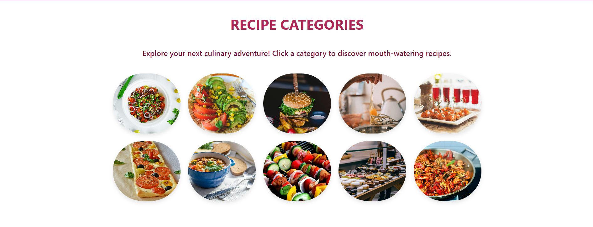
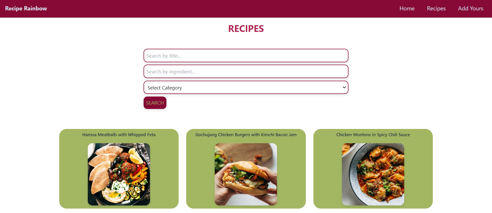

# Recipe Rainbow




## Table of Contents
- [About](#about)
- [Video](#video)
- [Tech](#tech)
- [Getting Started](#getting-started)
- [Code Examples](#code-examples)
- [Features](#features)
- [Status](#status)
- [Why?](#why)
- [Contact](#contact)
- [License](#license)

## About
Recipe Rainbow is a responsive web app for discovering and sharing recipes. Users can browse various categories, view detailed recipe instructions, add their recipes, and even leave comments. The app focuses on user-friendly design and functionality, ensuring a smooth experience across different screen sizes.

## Video
[Watch the demo](https://drive.google.com/file/d/14dXzJiPp_9B2hRA9IOCMb-6wyfjHAqwh/view?usp=drive_link)

## Tech
A list of the technologies and tools used in the project:
- React
- Django 
- Netlify
- Render
- HTML5
- JavaScript ES6
- Python
- Tailwind CSS
- React Router
- Google Fonts
- Motion for React (Farmer Motion)

## Getting Started

### Prerequisites
- Node.js
- Python/Django (Backend)

### Usage
You can access the live version of the application here: [Live Demo](https://reciperainbow.netlify.app/)

### Cloning the Repository (Optional)
If you still want to clone the repository and explore the code:
1. Clone the repository: `git clone https://github.com/Adrienner1988/recipe-rainbow.git`
2. Clone the repository: `git clone https://github.com/Adrienner1988/Recipe Blog.git`
3. Navigate to the project directory: `cd recipe-rainbow`
3. Navigate to the project directory: `cd Recipe Blog`
5. Install dependencies: `npm install`
6. Start the backend server: `python manage.py runserver`
7. Start the development server: `npm start`

## Code Examples
```javascript
const AddRecipe = () => {
  const [title, setTitle] = useState("");
  const [prep, setPrep] = useState(0);
  const [prepOptions, setPrepOptions] = useState<TimeOption[]>([]);
  const [cook, setCook] = useState(0);
  const [cookOptions, setCookOptions] = useState<TimeOption[]>([]);
  const [serving, setServing] = useState(0);
  const [servingOptions, setServingOptions] = useState<Servings[]>([]);
  const [category, setCategory] = useState(0);
  const [categoryOptions, setCategoryOptions] = useState<Category[]>([]);
  const [ingredients, setIngredients] = useState("");
  const [steps, setSteps] = useState("");
  const [image, setImage] = useState<File | null>(null);

  const navigate = useNavigate();

  const handleSubmit = async (event: React.FormEvent) => {
    event.preventDefault();

    const formData = new FormData();
    formData.append("title", title);
    formData.append("prep", prep.toString());
    formData.append("cook", cook.toString());
    formData.append("serving", serving.toString());
    formData.append("category", category.toString());
    formData.append("ingredients", ingredients);
    formData.append("steps", steps);
    if (image) {
      formData.append("image", image);
    }

```

## Features
- Browse various recipe categories
- View detailed recipe instructions and ingredients
- Adding recipes to the collection
- Recipe feedback commenting system
- Responsive design for seamless mobile and desktop use
- Intuitive, easy-to-use interface.

## Status
Recipe Rainbow is currently in a completed state with all core features functional. 

## Why
This project allowed me to explore full-stack development with React on the frontend and Django on the backend. It represents a combination of my passion for user-friendly design and robust functionality, making it a key project in my portfolio.

## Contact
- Email: `adriennerdaniels@gmail.com`
- LinkedIn: `https://www.linkedin.com/in/adriennerdaniels/`
- GitHub: `Adrienner1988`

## License
This project is currently not licensed.
